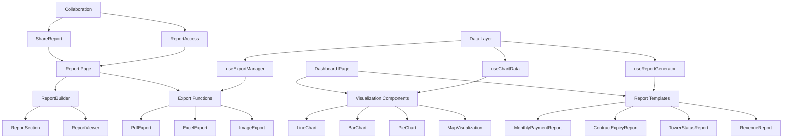

# Phase 3 Implementation Plan: Visualization & Reporting

## Overview

Phase 3 focuses on implementing data visualization and reporting capabilities for the Telecom Tower Data Analysis Platform. Building upon data processing and AI integration from Phase 2, this phase enables users to visualize tower data, generate reports, and share insights with team members.

## Timeline

- **Duration**: Weeks 5-6 (2 weeks)
- **Components**: Chart components, report templates, export functionality, collaboration features

## Implementation Plan

### Week 5: Data Visualization & Report Templates

#### 1. Chart Components (Days 1-2)

- **Create Base Visualization Components**:
  ```
  components/visualizations/
    LineChart.vue      # For trends (payment history, contracts over time)
    BarChart.vue       # For comparisons (towers by status, contracts by region)
    PieChart.vue       # For distributions (tower types, landlord concentration)
    DataTable.vue      # For tabular data with sorting and filtering
  ```

- **Implement Data Processing Utilities**:
  ```
  composables/
    useChartData.ts    # Transform API data to chart formats
    useDataAggregation.ts  # Sum, average, group by functions
  ```

#### 2. Geographic Visualization (Days 3-4)

- **Tower Location Map Component**:
  - Create `MapVisualization.vue` with Leaflet integration
  - Implement tower markers and clustering
  - Add interactive tooltips for tower information
  - Create heat maps for tower density

#### 3. Report Templates (Days 4-5)

- **Create Report Component System**:
  ```
  components/reports/
    ReportBuilder.vue     # Container component
    ReportSection.vue     # Modular report sections
    ReportViewer.vue      # Display generated reports
    templates/
      MonthlyPaymentReport.vue
      ContractExpiryReport.vue
      TowerStatusReport.vue
      RevenueReport.vue
  ```

### Week 6: Export Functions & Collaboration

#### 4. Export Functionality (Days 1-2)

- **Implement Export Components**:
  ```
  components/exports/
    PdfExport.vue
    ExcelExport.vue
    ImageExport.vue
  ```
  
- **Create Server Export Endpoints**:
  ```
  server/api/reports/
    [id]/export/pdf.ts
    [id]/export/excel.ts
    [id]/export/image.ts
  ```

#### 5. Report Management (Days 3-4)

- **Database Schema Updates**:
  ```sql
  CREATE TABLE reports (
    id UUID PRIMARY KEY DEFAULT uuid_generate_v4(),
    company_id UUID REFERENCES companies(id),
    created_by UUID REFERENCES users(id),
    report_type TEXT NOT NULL,
    title TEXT NOT NULL,
    description TEXT,
    parameters JSONB,
    content JSONB,
    created_at TIMESTAMP WITH TIME ZONE DEFAULT NOW(),
    updated_at TIMESTAMP WITH TIME ZONE DEFAULT NOW()
  );
  ```

- **Create Report Pages**:
  ```
  pages/reports/
    index.vue     # Report list
    create.vue    # Create new report
    [id].vue      # View specific report
    edit/[id].vue # Edit report
  ```

#### 6. Collaborative Features (Day 5)

- **Implement Sharing Capabilities**:
  ```sql
  CREATE TABLE report_shares (
    id UUID PRIMARY KEY DEFAULT uuid_generate_v4(),
    report_id UUID REFERENCES reports(id),
    shared_by UUID REFERENCES users(id),
    shared_with UUID REFERENCES users(id),
    access_level TEXT NOT NULL,
    created_at TIMESTAMP WITH TIME ZONE DEFAULT NOW(),
    expires_at TIMESTAMP WITH TIME ZONE
  );
  ```

- **Share Components**:
  ```
  components/collaboration/
    ShareReport.vue
    ReportAccess.vue
  ```

## Technical Implementation Details

### Required Libraries

- **Visualization**: Recharts (already available in the project)
- **Mapping**: Leaflet.js
- **Export**: jsPDF, SheetJS
- **Utility**: html2canvas, lodash (already available)

### API Implementation

- **Report Management API**:
  - Create CRUD endpoints for reports
  - Create endpoints for report sharing
  - Implement export endpoints with appropriate content types

- **Data Aggregation API**:
  - Create endpoints for aggregated data used in visualizations
  - Implement caching for frequently accessed visualizations

## Database Schema

- **Reports Table**: Store report definitions and content
- **Report Shares Table**: Track sharing permissions
- **Report Comments Table**: Allow collaboration via comments

## Testing Strategy

1. **Unit Tests**:
   - Test chart data transformation functions
   - Test export formatting

2. **Component Tests**:
   - Test visualization components with mock data
   - Test report templates rendering

3. **Integration Tests**:
   - Test full report generation flow
   - Test export functionality

## Risk Assessment

| Risk | Probability | Impact | Mitigation |
|------|------------|--------|------------|
| Performance issues with large datasets | Medium | High | Implement data pagination and lazy loading |
| Export formatting inconsistencies | Medium | Medium | Create comprehensive export templates with thorough testing |
| Map visualization challenges | Medium | High | Start with basic map features, then enhance incrementally |

## Success Criteria

- Users can visualize tower data through interactive charts and maps
- Standard reports can be generated with a single click
- Reports can be exported in multiple formats (PDF, Excel)
- Reports can be shared with appropriate access controls
- Loading time for reports should be under 3 seconds for standard datasets

## Component Architecture

