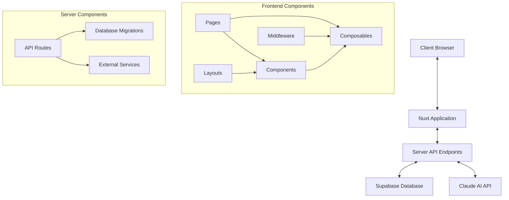

# System Patterns

## Architecture Overview

DataNexus follows a modern web application architecture built on Nuxt.js. The system is organized using a component-based approach with clear separation of concerns.



## Core Technical Patterns

### Frontend Architecture

1. **Component-Based Design**
   - Reusable Vue components organized by feature/function
   - Specialized components for visualizations (charts, maps)
   - Component composition for complex interfaces

2. **Composables Pattern**
   - Reusable logic extracted into composable functions
   - Clear separation between UI and business logic
   - State management through composables

3. **Page-Based Routing**
   - File-based routing through Nuxt pages directory
   - Nested routes for complex features
   - Dynamic routes for entity-specific views

4. **Middleware Security**
   - Route protection via auth middleware
   - Guest-only routes for authentication flows
   - Security middleware for additional protections

### Backend Architecture

1. **API-First Design**
   - RESTful API endpoints for all server operations
   - Structured API responses with consistent formats
   - Server-side validation for all incoming data

2. **Database Management**
   - SQL migrations for versioned schema changes
   - Strong typing for database entities
   - Separation of data access from business logic

3. **External Service Integration**
   - Claude API for AI-assisted analysis
   - Email notifications service
   - Structured export services (PDF, Excel, Image)

## Key Design Patterns

### Data Flow Patterns

1. **Import Pipeline**
   ```mermaid
   flowchart LR
       Upload[File Upload] --> Validation[Data Validation]
       Validation --> Normalization[Data Normalization]
       Normalization --> Aggregation[Data Aggregation]
       Aggregation --> Storage[Database Storage]
   ```

2. **Reporting Pipeline**
   ```mermaid
   flowchart LR
       Data[Data Source] --> Builder[Report Builder]
       Builder --> Viewer[Report Viewer]
       Viewer --> Export[Export Options]
       Viewer --> Share[Share Functions]
   ```

3. **Authentication Flow**
   ```mermaid
   flowchart TD
       Login[Login/Register] --> Auth[Authentication]
       Auth -->|Success| Session[Session Management]
       Auth -->|Failure| Error[Error Handling]
       Session --> Protected[Protected Routes]
   ```

### Component Interaction Patterns

1. **Props Down, Events Up**
   - Parent components pass data as props
   - Child components emit events for parent handling
   - Keeps component relationships clear and unidirectional

2. **Composable State Management**
   - Shared state managed through composables
   - Reactive state using Vue's reactivity system
   - Consistent state access patterns across components

3. **Form Validation Pattern**
   - Input components with self-contained validation
   - Form-level validation for cross-field rules
   - Validation summary for user feedback

## Testing Strategy

1. **Unit Testing**
   - Component isolation tests
   - Composable function tests
   - Mock-based testing for external dependencies

2. **Integration Testing**
   - API endpoint testing
   - Workflow testing across components
   - Service integration verification

3. **End-to-End Testing**
   - User scenario testing
   - Full application flow testing
   - Browser-based interaction testing
